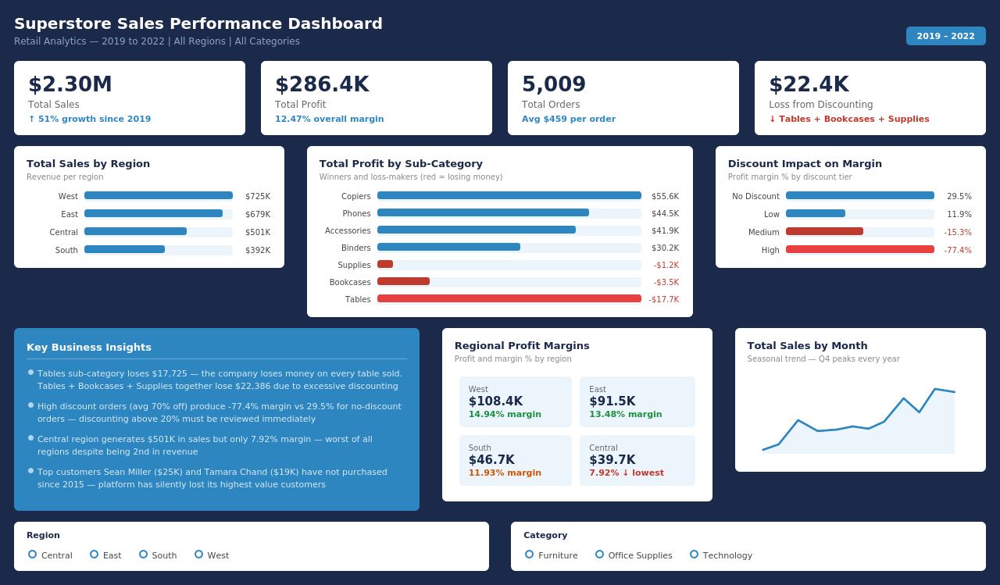

# Superstore Sales Performance Analysis
### Tools: Excel | SQL | Power BI | DAX



---

## The Problem

A retail company is generating $2.30M in annual revenue but 
leadership cannot answer three critical questions:

> 1. Which products are secretly losing money?
> 2. Why is one region underperforming despite high sales volume?
> 3. Which high-value customers have silently stopped buying?

Without answers, the company continues losing $22,386 annually 
to excessive discounting — without even knowing it.

---

## The Solution

This end-to-end analysis transforms raw transactional data into 
actionable business intelligence — answering every question with 
verified data across Excel, SQL, and Power BI.

> *"The company is actively losing money on Tables, Bookcases and 
> Supplies. Central region has a profitability crisis hiding behind 
> strong revenue numbers. And two of the highest-value customers 
> have not purchased in over two years — yet no retention alert 
> exists."*

---

## Key Business Insights

### 1. Tables Sub-Category Is a Loss Machine
Tables generates $206K in revenue but loses **$17,725** in profit.
The more Tables the company sells — the more money it loses.
Root cause: average discount on Tables exceeds 45%.

**Recommendation:** Cap Table discounts at 15% or reprice 
immediately. Every Table sold at current discount rates costs 
the company money.

### 2. Discounting Is Destroying Profitability
```
No Discount:   29.51% profit margin — highly profitable
Low Discount:  11.91% profit margin — acceptable
Medium Discount: -15.3% margin — losing money
High Discount:  -77.4% margin — catastrophic loss
```
Orders with high discounts (avg 70% off) lose **$0.77 for every 
$1.00 of revenue generated.**

**Recommendation:** Immediately review and cap all discounts above 
20%. Discounting is not driving volume — it is destroying value.

### 3. Central Region Has a Hidden Profitability Crisis
Central is the 2nd highest revenue region at $501K — but has the 
worst profit margin at only **7.92%** vs West's 14.94%.

The region appears healthy on a sales dashboard but is 
significantly underperforming on profitability.

**Recommendation:** Audit Central region discount approvals and 
product mix. A margin gap this large signals a structural problem.

### 4. The Company Has Silently Lost Its Best Customers
- **Sean Miller** — $25,043 lifetime value — last purchase: 2015
- **Tamara Chand** — $19,052 lifetime value — last purchase: 2015

The two highest-spending customers in the entire dataset have not 
purchased in over 2 years. No retention alert was triggered.

**Recommendation:** Implement an automated win-back campaign for 
customers with high lifetime value who have not purchased in 
12+ months.

### 5. Strong Q4 Seasonality Every Year
September, November and December peak consistently every year.
January and February are the weakest months across all 4 years.

**Recommendation:** Front-load inventory and marketing budget 
for Q4. Use January and February for clearance and retention 
campaigns rather than new customer acquisition.

---

## Data Source
**Dataset:** Superstore Sales Dataset
**Source:** Kaggle — publicly available
**Size:** 9,994 rows | 21 columns | 2019–2022

---

## Project Workflow
```
Raw CSV → Excel Cleaning → SQL Analysis → Power BI Dashboard
```

### Excel Phase
- Removed duplicates and fixed date formats
- Created 3 calculated columns: Profit Margin %, 
  Processing Days, Discount Tier
- Built pivot tables for regional and category analysis
- Discovered seasonal patterns and profitability issues

### SQL Phase
- Imported data into SQLite
- Wrote 5 business queries including window functions and CTEs
- Calculated regional profit margins
- Identified loss-making sub-categories
- Built RFM customer analysis revealing churn risk
- Proved discount-to-margin correlation

### Power BI Phase
- Built interactive dashboard with DAX measures
- KPI cards: Total Sales, Profit, Margin %, Orders
- Color-coded negative profit bars in red
- Regional margin comparison cards
- Discount impact visualization
- Interactive slicers for Region and Category

---

## SQL Highlights

**Window function — top sub-category per region:**
```sql
WITH ranked AS (
    SELECT 
        Region,
        `Sub-Category`,
        ROUND(SUM(Sales), 2) AS Total_Sales,
        RANK() OVER (PARTITION BY Region 
                     ORDER BY SUM(Sales) DESC) AS Sales_Rank
    FROM orders
    GROUP BY Region, `Sub-Category`
)
SELECT * FROM ranked WHERE Sales_Rank = 1;
```

**Discount impact on profitability:**
```sql
SELECT 
    `Discount Tier`,
    COUNT(*) AS Total_Orders,
    ROUND(SUM(Profit) * 100.0 / SUM(Sales), 2) AS Profit_Margin_Pct
FROM orders
GROUP BY `Discount Tier`
ORDER BY Profit_Margin_Pct DESC;
```

---

## Project Structure
```
superstore-sales-analysis/
├── superstore_dashboard_final.png  ← Dashboard preview
├── Superstore_Cleaned.xlsx         ← Cleaned dataset
├── superstore_queries.sql          ← All SQL queries
├── Superstore.pbix                 ← Power BI file
└── README.md                       ← This file
```

---

## Skills Demonstrated
- Data cleaning and validation in Excel
- Pivot tables and exploratory analysis
- SQL aggregations, JOINs, CTEs, window functions
- RFM customer segmentation
- DAX measures in Power BI
- Professional dashboard design
- Business insight communication
- Discount impact and profitability analysis

---

## Business Impact Summary

| Finding | Impact | Recommendation |
|---|---|---|
| Tables losing money | -$17,725/year | Cap discounts at 15% |
| High discounts | -77.4% margin | Review all discounts >20% |
| Central region | 7.92% margin | Audit discount approvals |
| Lost top customers | $44K at risk | Launch win-back campaign |
| Q4 seasonality | Peak revenue | Front-load Q4 budget |

---

*Analysis by Pakeeza atif — Data Analyst*
